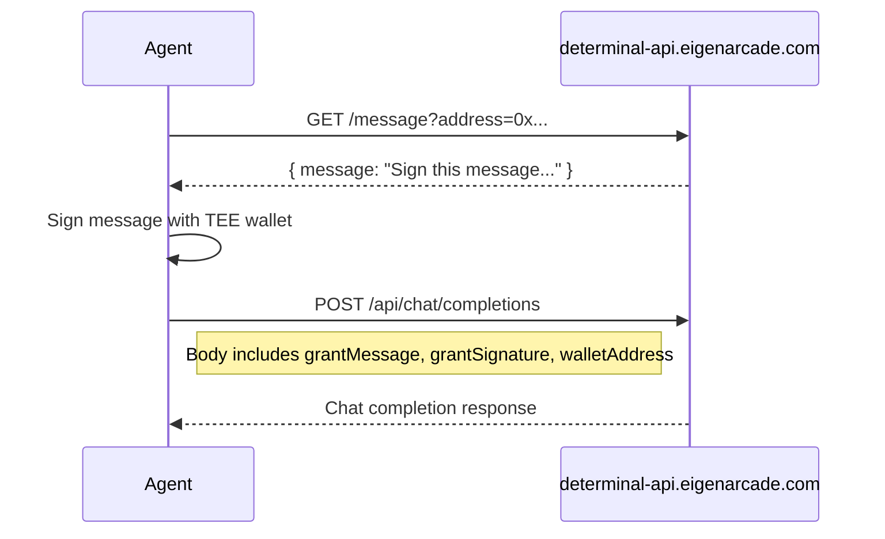

# EigenAI Reference

> Source: Context7 `/layr-labs/eigencloud-docs`

## Endpoints

| Environment | URL |
|-------------|-----|
| Sepolia (testnet) | `https://eigenai-sepolia.eigencloud.xyz/v1/chat/completions` |
| Mainnet | `https://eigenai.eigencloud.xyz/v1/chat/completions` |

## Authentication

There are two authentication methods available:

### API Key Authentication (Standard)

```
Header: X-API-Key: <your-api-key>
Header: Content-Type: application/json
```

### Grant-Based Authentication (TEE Wallet)

For agents running in EigenCompute TEE, authentication can be done via wallet signature without requiring an API key. This uses the agent's TEE-derived wallet to sign a grant message.

**Endpoint:** `https://determinal-api.eigenarcade.com`

**Flow:**



**Step 1: Fetch grant message**

```bash
curl "https://determinal-api.eigenarcade.com/message?address=0xYourWalletAddress"
```

Response:
```json
{ "message": "Sign this message to authenticate with EigenAI..." }
```

**Step 2: Sign the message with your wallet**

```typescript
import { signMessage } from "./wallet.js"; // TEE wallet module
const signature = await signMessage(message);
```

**Step 3: Include grant credentials in chat completion request**

```json
{
  "model": "gpt-oss-120b-f16",
  "messages": [{"role": "user", "content": "Hello"}],
  "grantMessage": "Sign this message to authenticate...",
  "grantSignature": "0x...",
  "walletAddress": "0xYourWalletAddress"
}
```

**Check grant status:**

```bash
curl "https://determinal-api.eigenarcade.com/checkGrant?address=0xYourWalletAddress"
```

Response:
```json
{ "hasGrant": true, "tokenCount": 1000000 }
```

**Full TypeScript Example:**

```typescript
const GRANT_API = "https://determinal-api.eigenarcade.com";

let cachedGrant: { message: string; signature: string } | null = null;

async function getGrantAuth(walletAddress: string, signFn: (msg: string) => Promise<string>) {
  if (cachedGrant) return cachedGrant;
  
  const res = await fetch(`${GRANT_API}/message?address=${walletAddress}`);
  const { message } = await res.json();
  const signature = await signFn(message);
  
  cachedGrant = { message, signature };
  return cachedGrant;
}

async function chatWithGrant(userMessage: string, walletAddress: string, signFn: (msg: string) => Promise<string>) {
  const grant = await getGrantAuth(walletAddress, signFn);
  
  const response = await fetch(`${GRANT_API}/api/chat/completions`, {
    method: "POST",
    headers: { "Content-Type": "application/json" },
    body: JSON.stringify({
      model: "gpt-oss-120b-f16",
      messages: [{ role: "user", content: userMessage }],
      grantMessage: grant.message,
      grantSignature: grant.signature,
      walletAddress,
    }),
  });
  
  return response.json();
}
```

## Available Models

| Model ID | Notes |
|----------|-------|
| `gpt-oss-120b-f16` | Only model documented in EigenCloud docs. Use this unless `/v1/models` reveals others. |

## Chat Completions

### Basic Request

```bash
curl -X POST https://eigenai-sepolia.eigencloud.xyz/v1/chat/completions \
  -H "X-API-Key: <api-key>" \
  -H "Content-Type: application/json" \
  -d '{
    "model": "gpt-oss-120b-f16",
    "max_tokens": 120,
    "seed": 42,
    "messages": [{"role": "user", "content": "Write a story about programming"}]
  }'
```

### Request Body

| Field | Type | Required | Description |
|-------|------|----------|-------------|
| `model` | string | Yes | Model ID (e.g., `gpt-oss-120b-f16`) |
| `max_tokens` | integer | No | Maximum tokens to generate |
| `seed` | integer | No | Seed for deterministic output |
| `messages` | array | Yes | Array of `{role, content}` objects |
| `tools` | array | No | Tool/function definitions for structured output |
| `tool_choice` | string | No | `"auto"`, `"none"`, or specific tool object |

### Response

```json
{
  "id": "chatcmpl-eigenai-llama-1758835890305965",
  "created": 1758835890,
  "model": "gpt-oss-120b-f16",
  "choices": [{
    "index": 0,
    "message": {
      "role": "assistant",
      "content": "Response text here..."
    },
    "finish_reason": "length"
  }],
  "usage": {
    "completion_tokens": 120,
    "prompt_tokens": 72,
    "total_tokens": 192
  },
  "signature": "2ee2e48ae9f6796c1de67977981d937c886efec3957c9bfc28f7a3f3be8262f0..."
}
```

## Tool Calling

EigenAI supports OpenAI-compatible tool calling. Use this for structured routing responses instead of free-text JSON parsing.

### Request with Tools

```json
{
  "model": "gpt-oss-120b-f16",
  "seed": 42,
  "messages": [{"role": "user", "content": "What is the weather in Boston?"}],
  "tools": [{
    "type": "function",
    "function": {
      "name": "get_current_weather",
      "description": "Get the current weather in a given location",
      "parameters": {
        "type": "object",
        "properties": {
          "location": { "type": "string", "description": "City and state" },
          "unit": { "type": "string", "enum": ["celsius", "fahrenheit"] }
        },
        "required": ["location"]
      }
    }
  }],
  "tool_choice": "auto"
}
```

### Tool Call Response

When the model decides to use a tool, `choices[0].message.content` is `null` and `tool_calls` is populated:

```json
{
  "choices": [{
    "message": {
      "role": "assistant",
      "content": null,
      "tool_calls": [{
        "id": "call_YDzzMHFtp1yuURbiPe09uyHt",
        "type": "function",
        "function": {
          "name": "get_current_weather",
          "arguments": "{\"location\":\"Boston, MA\",\"unit\":\"fahrenheit\"}"
        }
      }]
    },
    "finish_reason": "tool_calls"
  }]
}
```

### Providing Tool Results Back

```json
{
  "model": "gpt-oss-120b-f16",
  "messages": [
    {"role": "user", "content": "What is the weather in Boston?"},
    {
      "role": "assistant",
      "content": null,
      "tool_calls": [{
        "id": "call_YDzzMHFtp1yuURbiPe09uyHt",
        "type": "function",
        "function": {
          "name": "get_current_weather",
          "arguments": "{\"location\":\"Boston, MA\",\"unit\":\"fahrenheit\"}"
        }
      }]
    },
    {
      "role": "tool",
      "tool_call_id": "call_YDzzMHFtp1yuURbiPe09uyHt",
      "content": "58 degrees"
    }
  ]
}
```

## Signature Verification

Every EigenAI response includes a `signature` field (hex-encoded). This proves the response was generated by EigenLabs' operator and has not been tampered with.

### Verification Algorithm

1. Extract prompt: concatenate all `request.messages[].content` (in order, no separators)
2. Extract output: concatenate all `response.choices[].message.content` (in order, no separators)
3. Construct message: `chain_id + model_id + prompt + output` (no separators)
4. Recover signer address from the signature using EIP-191
5. Compare recovered address to known signer

### Known Signer Addresses

| Network | Address |
|---------|---------|
| Mainnet (chain_id: `1`) | `0x7053bfb0433a16a2405de785d547b1b32cee0cf3` |
| Sepolia (chain_id: `11155111`) | `0xB876f1301b39c673554EE0259F11395565dCd295` |

### TypeScript (ethers v6)

```typescript
import { verifyMessage } from 'ethers';

function verifyEigenAISignature(
  requestMessages: Array<{content: string}>,
  responseChoices: Array<{message: {content: string}}>,
  signature: string,
  chainId: string = "11155111",
  modelId: string = "gpt-oss-120b-f16"
): boolean {
  const prompt = requestMessages.map(m => m.content).join("");
  const output = responseChoices.map(c => c.message.content).join("");
  const message = `${chainId}${modelId}${prompt}${output}`;

  const recovered = verifyMessage(message, '0x' + signature);

  const SEPOLIA_SIGNER = "0xB876f1301b39c673554EE0259F11395565dCd295";
  const MAINNET_SIGNER = "0x7053bfb0433a16a2405de785d547b1b32cee0cf3";

  const expected = chainId === "1" ? MAINNET_SIGNER : SEPOLIA_SIGNER;
  return recovered.toLowerCase() === expected.toLowerCase();
}
```

### JavaScript (ethers v6)

```javascript
import { verifyMessage } from 'ethers';
const recovered = verifyMessage(message, '0x' + signature);
```

### Python (eth-account)

```python
from eth_account.messages import encode_defunct
from eth_account import Account

message_obj = encode_defunct(text=message)
signature_bytes = bytes.fromhex(response_signature)
recovered = Account.recover_message(message_obj, signature=signature_bytes)
```

### Rust (alloy)

```rust
use alloy_primitives::hex;
use alloy_signer::Signature;

let signature_bytes = hex::decode(response_signature)?;
let signature = Signature::try_from(signature_bytes.as_slice())?;
let recovered = signature.recover_address_from_msg(message.as_bytes())?;
```
